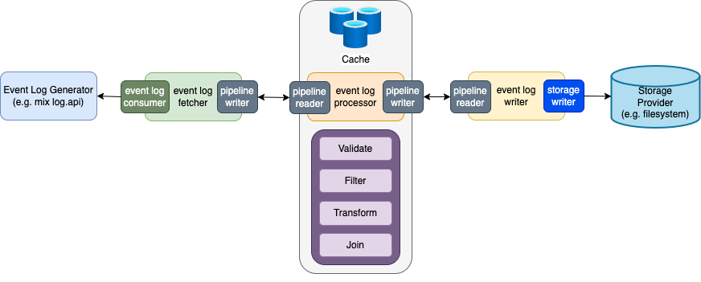

# Mix Event Log Collector

The `mix-event-log-collector` offers users of the Mix platform with an out-of-box solution for collecting event log data via the `mix.log` api.

## Overview

The `mix-event-log-collector` provides a scalable and highly configurable event log data pipeline and processing solution that can be leveraged by Nuance customers for accessing near real-time event log data generated in the Mix run-time and on-premise deployments for reporting and analytics. 

The `mix-event-log-collector` can run either as a single stand-alone client, or as a distributed set of services that can scale separately, as needed, for fetching, processing, and writing event log data to a storage provider.

`mix-event-log-collector` is composed of 3 core components:
1. `event log fetcher`: consumes event logs from an event log producer, such as mix log.api
2. `event log processor`: validates, filters, transforms, and joins event logs
3. `event log writer`: writes processed event logs to a storage provider such as 
   * filesystem
   * elasticsearch
   * opensearch
   * mongodb
   * fluentd
   * neap AFO/AFT
   * mix log producer api

Each component can be run as it's own command-line application allowing for independent scaling of components and the ability to re-process previously fetched event log data.

This project also provides an `event-log-client` command-line application that wraps all three components mentioned above. This offers a simple stand-alone client that can be run locally and is designed for non-production scenarios such as dev and QA activities.

 

### High-level Architecture

The mix-event-log-collector implements a scalable and highly configurable data pipelining solution. The data pipeline supports:
* Filesystem-backed FIFO queue when running as a local application
* Kafka for a reliable, distributed message store
* Redis pub/sub for a fast and simple message store
* Pulsar for a cloud-native, multi-tenant, high-performance solution

> For more information on the Mix Log API specification and how `log.api` works, please refer to the [online documentation](https://docs.mix.nuance.com/runtime-event-logs/#nuance-mix-runtime-event-logs).

## Guides
* [Quickstart Guide](./guides/quickstart-guide.md)
* [Configuration Guide](./guides/configuration-guide.md)
* [Developer Guide](./guides/developer-guide.md)
* [Deployment Guide](./guides/deployment-guide.md)
* [Monitoring Guide](./guides/monitoring-guide.md)

## Contributing

This project welcomes contributions and suggestions.  Most contributions require you to agree to a
Contributor License Agreement (CLA) declaring that you have the right to, and actually do, grant us
the rights to use your contribution. For details, visit https://cla.opensource.microsoft.com.

When you submit a pull request, a CLA bot will automatically determine whether you need to provide
a CLA and decorate the PR appropriately (e.g., status check, comment). Simply follow the instructions
provided by the bot. You will only need to do this once across all repos using our CLA.

This project has adopted the [Microsoft Open Source Code of Conduct](https://opensource.microsoft.com/codeofconduct/).
For more information see the [Code of Conduct FAQ](https://opensource.microsoft.com/codeofconduct/faq/) or
contact [opencode@microsoft.com](mailto:opencode@microsoft.com) with any additional questions or comments.

## Trademarks

This project may contain trademarks or logos for projects, products, or services. Authorized use of Microsoft 
trademarks or logos is subject to and must follow 
[Microsoft's Trademark & Brand Guidelines](https://www.microsoft.com/en-us/legal/intellectualproperty/trademarks/usage/general).
Use of Microsoft trademarks or logos in modified versions of this project must not cause confusion or imply Microsoft sponsorship.
Any use of third-party trademarks or logos are subject to those third-party's policies.
