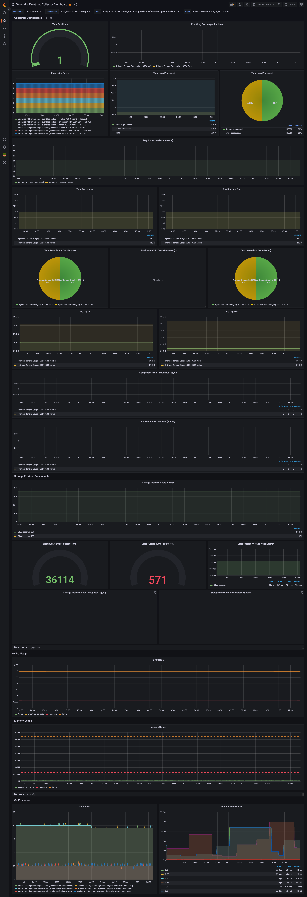

# Monitoring Guide

## Metrics Monitoring via Prometheus & Grafana

### Deploying Prometheus and Grafana

Please refer to the [Deployment Guide](./deployment-guide.md#grafana--prometheus) for deploying prometheus and grafana into your kubernetes cluster

> If running `event-log-collector` locally, the `docker-compose.yaml` brings up an instance of each, and this project includes configuration files and a dashboard in the `configs/` folder

### Understanding how the 'kube-prometheus-stack' works

Please refer to [Get Started with Grafana and Prometheus](https://grafana.com/docs/grafana/latest/getting-started/get-started-grafana-prometheus/)

### `event-log-collector` Metrics

> The prometheus metrics of Event Log Collector are exposed over 8078 port by default. 

> All `event-log-collector` metrics are prefixed with `elc_`

`event-log-collector` tracks:

**For each component (fetcher, processor, writer)**
* Lag in/out
* Processing errors
* Total records in/out
* Total logs processed
* Log processing duration

**Specific to `event-log-fetcher`**

* Total number of partitions from which event log data is being fetched
* Event log backlog for each partition (is event-log-fetcher falling behind?)

**Specific to `event-log-writer`**
* Total writes to storage provider
* Total Write success/failure
* Write latency

> In addition, standard OS metrics are available in grafana by default, including:
> * CPU utization
> * Memory utilization

### `event-log-collector` Monitoring Dashboard

The following dashboard is provided as part of the project.

